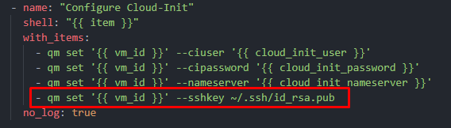

# Proxmox Ubuntu Cloud Template:

This ansible playbook creates a Proxmox virtual machine template using the Ubuntu Cloud image, it also leverages [cloud-init](https://cloudinit.readthedocs.io/en/latest/) to do some small configuration on the final image, like setting the user, dns, and ssh key.

## Tested with: 

| Environment | Application | Version  |
| ----------------- |-----------|---------|
| WSL2 Ubuntu 20.04 | Ansible Core | v2.13.4  |
|  | Proxmox | v7.2-11  |
| Proxmox | Python | v3.9.2  |

## Initialization How-To:
Located in the root directory, create a file called `vars.yml` with content like the following:

```yml
---
# Connection to host proxmox details:
proxmox_host: 192.168.111.222
ssh_user: root
# URL to download the Ubuntu Cloud image
cloud_image: https://cloud-images.ubuntu.com/focal/current/focal-server-cloudimg-amd64.img
# VM details:
vm_id: 1000
vm_name: ubuntu-cloud
vcores: 2
vram: 2048
storage: local-lvm
# Cloud-Init Config:
cloud_init_user: some_username
cloud_init_password: SuperSecretPassword
cloud_init_nameserver: 1.1.1.1,8.8.8.8
```
> :warning: Change the values accordingly  

## Deployment How-To:

Located in the root directory, run the `ansible_apply.sh` script:

```bash
./ansible_apply.sh
```

## Create a VM using the template:

Right click on the template and select "Clone"


In the new windows select Full Clone, give it a name and click "Clone":


> ## Differences between Full Clone vs Linked Clone:
> - **Full Clone**: A full clone VM is a complete copy and is fully independent from the original VM or VM Template, but it requires the same disk space as the original.
> - **Linked Clone**: A linked clone VM requires less disk space but cannot run without access to the base VM Template. Linked Clones works for theses storages: files in raw, qcow2, vmdk format (either on local storage or nfs); LVM-thin, ZFS, rbd, sheepdog, nexenta. It's not supported with LVM & ISCSI storage.
>
> Ref.: [VM Templates and Clones](https://pve.proxmox.com/wiki/VM_Templates_and_Clones)

> :bulb: You can also create new clones using the CLI::

```bash
qm clone 1000 100 --name testing --full
```

## Important considerations:

In this playbook I'm setting the cloud-init ssh key to be the same as the one that came with proxmox "out of the box":



To use that ssk-key to connect to the vm you need to copy the private ssh key from the proxmox server to your local machine:


My preferred way of doing this is to simply copy the content of the key, and create the file in my local machine as follow:

```bash
cd ~/.ssh/
vim my_proxmox_key.pem
# <paste the content of the key, save and exit>
chmod 600 my_proxmox_key.pem
```

Now to connect to the server you can do:
```bash
ssh -i ~/.ssh/my_proxmox_key.pem {user}@{ip}
```
> :warning: Change the values of {user} and {ip} accordingly 

If you don't want to use this ssh key, create your own key, copy the key to the proxmox server (in the `/root/.ssh/` directory) and make the necessary changes to the playbook tasks.

## Author:

- [@JManzur](https://jmanzur.com)

## Documentation:

- [Cloud-Init Support](https://pve.proxmox.com/wiki/Cloud-Init_Support)
- [community.general.proxmox_kvm module](https://docs.ansible.com/ansible/latest/collections/community/general/proxmox_kvm_module.html)
- [ansible.builtin.get_url module](https://docs.ansible.com/ansible/latest/collections/ansible/builtin/get_url_module.html)